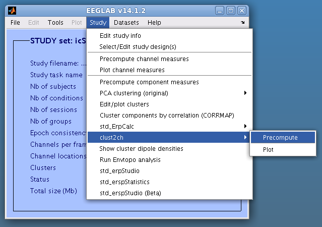
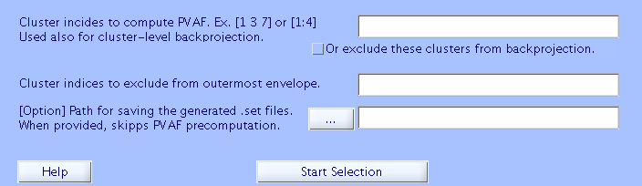
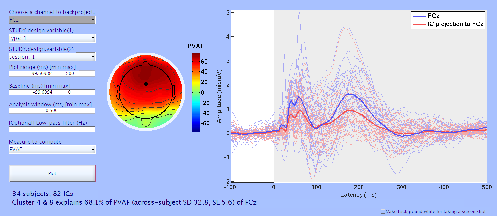

std_clust2ch() is a renewed version of std_selectICsByCluster(). I
forgot to use std_selectICsByCluster, and when I used it did not work.
When I tried to fix the problem, I found code was not very clear. Thus I
re-made it into a simpler, more intuitive version.

What does std_clust2ch do?
--------------------------

1.  std_clust2ch performs cluster-level IC selection & backprojection to
    generate another set of .set files. All the ICs rejected in the
    process of creating the final cluster selection will be excluded
    (i.e., rejected) in the newly generated .set files. The IC rejection
    mask is saved in EEG.etc.originalIcIdxBeforeClusterIcSelection.
2.  std_clust2ch performs IC cluster-to-scalp channel projection and
    computes either percent variance accounted for (PVAF) or area under
    a curve (AUC) explained by the ICs included by the selected
    clusters.

GUI screenshots and comments (09/13/2018 updated)
-------------------------------------------------

This is how GUI menu on EEGLAB STUDY looks. Precompute first, then plot.

If you specify the save path, the plugin will save the new .set files
after rejecting ICs. The generated .set files can be used straight for
SIFT and MPT.

For this plugin, percent variance accounted for (PVAF) measures variance
across time within a user-specified window, and percent power accounted
for (PPAF) measures IC's contribution to channel in power. In EEGLAB
envtopo() functions, PVAF and PPAF are calculated as follows.

`PVAF = 100 - 100 x meanAcrossTime(varAcrossChannels(allICs - selectedICs))/meanAcrossTime(varAcrossChannels(allICs))`
`PPAF = 100 - 100 x meanAcrossTime((allICs - selectedICs).^2)/meanAcrossTime(allICs.^2)`

Note that calculation of variance removes DC part of the selected
window, which is fine for envtopo() PVAF because zero-sum assumption is
guaranteed by average referencing. However, DC difference between
contributor (IC ERP) and receiver (scalp channel ERP) is critical
information in ERP (i.e., which P300 is larger!) To address this, using
PPAF may be more optimal.

As an alternative measure, area under a curve (AUC) is implemented as
well. AUC would be suitable for examining a time window around a broad
peak/trough.

See also the older version
--------------------------

See also [this page](https://sccn.ucsd.edu/wiki/Std_clust2ch) for
further information about the older version called
*std_selectICsByCluster()*.